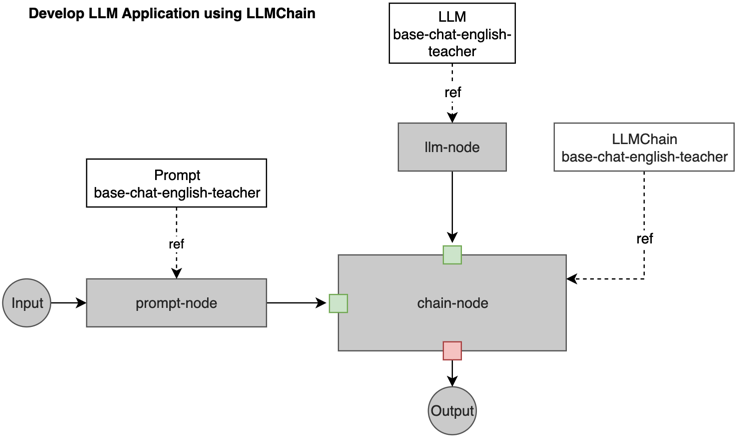

We'll introduce how to use LLMChain to create a simple LLM application workflow.

Here is the yaml file to define the workflow, you can get the full file from https://github.com/kubeagi/arcadia/blob/main/config/samples/app_llmchain_englishteacher.yaml.
```yaml
apiVersion: arcadia.kubeagi.k8s.com.cn/v1alpha1
kind: Application
metadata:
  name: base-chat-english-teacher
  namespace: arcadia
spec:
  displayName: "AI英语老师"
  description: "最简单的应用，AI英语老师"
  prologue: "Hello, I am English Teacher KubeAGI 🤖"
  nodes:
    - name: Input
      displayName: "用户输入"
      description: "用户输入节点，必须"
      ref:
        kind: Input
        name: Input
      nextNodeName: ["prompt-node"]
    - name: prompt-node
      displayName: "prompt"
      description: "设定prompt，template中可以使用{{xx}}来替换变量"
      ref:
        apiGroup: prompt.arcadia.kubeagi.k8s.com.cn
        kind: Prompt
        name: base-chat-english-teacher
      nextNodeName: ["chain-node"]
    - name: llm-node
      displayName: "zhipu大模型服务"
      description: "设定质谱大模型的访问信息"
      ref:
        apiGroup: arcadia.kubeagi.k8s.com.cn
        kind: LLM
        name: base-chat-english-teacher
      nextNodeName: ["chain-node"]
    - name: chain-node
      displayName: "llm chain"
      description: "chain是langchain的核心概念，llmChain用于连接prompt和llm"
      ref:
        apiGroup: chain.arcadia.kubeagi.k8s.com.cn
        kind: LLMChain
        name: base-chat-english-teacher
      nextNodeName: ["Output"]
    - name: Output
      displayName: "最终输出"
      description: "最终输出节点，必须"
      ref:
        kind: Output
        name: Output
---
apiVersion: prompt.arcadia.kubeagi.k8s.com.cn/v1alpha1
kind: Prompt
metadata:
  name: base-chat-english-teacher
  namespace: arcadia
spec:
  displayName: "设定英语老师的prompt"
  description: "设定英语老师的prompt ..."
  userMessage: |
    I want you to act as an English translator...
  input:
    kind: "Input"
  output:
    apiGroup: chain.arcadia.kubeagi.k8s.com.cn
    kind: LLMChain
---
apiVersion: chain.arcadia.kubeagi.k8s.com.cn/v1alpha1
kind: LLMChain
metadata:
  name: base-chat-english-teacher
  namespace: arcadia
spec:
  displayName: "llm chain"
  description: "llm chain"
  memory:
    maxTokenLimit: 20480
  input:
    llm:
      apiGroup: arcadia.kubeagi.k8s.com.cn
      kind: LLM
    prompt:
      apiGroup: prompt.arcadia.kubeagi.k8s.com.cn
      kind: Prompt
  output:
    apiGroup: "arcadia.kubeagi.k8s.com.cn"
    kind: "Output"
```
Here is the diagram that shows the nodes and referred resources, it may help you understand how it works.



Explanation about the attributes in the yaml:

* Application - Kubernetes CRD as an abstraction of LLM application.
  * prologue
An initial or introductory part of a conversation or dialogue

  * nodes
List of nodes in this LLM application. Every node has name, displayName, description. And ref is the runtime object that this node refer to, normally it should have kind, name and optinal apiGroup. The nextNodeName is the next linked node to run.

    * Input: the first node of LLM app, and need the input from user, the next node will be prompt-node.
    * prompt-node: the node to handle the prompt from Input and refer to a Prompt resource, the next node will be chain-node.
    * llm-node: it's used to declare the LLM resource, and can be linked to the nodes that will use this LLM to run some task, the next node will be chain-node.
    * chain-node: it refers to the LLMChain resource, and have prompt-node and llm-node as input. Chain is the core concept of langchain, and LLMChain is used to connect "Prompt" and "LLM". The next node will be Output.
    * Output: declare the end node of LLM app and receive output message.

* Prompt - Kubernetes CRD as an abstraction of LLM prompt.
 Refer to the initial input or instruction provided to a Large Language Model (LLM) to guide its generation of text or responses.
 The input and output is just to limit the type of node that can be connected to this Prompt node, so it's not used during runtime.

* LLMChain  - Kubernetes CRD as an abstraction of LLM chain.
Connect and extend the output of an LLM to generate a coherent and contextually consistent sequence of text. The output of one LLM becomes the input or continuation of another LLM, creating a chain-like structure.
The input and output is just to limit the type of node that can be connected to this LLMChain node, so it's not used during runtime.
 
* LLM - the LLM model service, such as baichuan-7b, qwen-14b, or embedding service, such as bge, m3e. Here we're using 'zhipuai' as the LLM and refer to the API key in a secret.

So nodes inside the Appilcation resource is the definition of the workflow, and they are connected with each other using nextNodeName. Each node also refer to K8s resources that defined using other resources, like Prompt, LLM, LLMChain. During runtime, the workflow will run as how Application defined, and use the data specified in Prompt, LLM, LLMChain resources.

Input and Output nodes are system built-in nodes, in order to better identify the start and end of the workflow, so no real resource is referred.

Note, the ref of each node in the Application definition, kind and apiGroup will limit the type of this node, and the name determines the ultimately associated resource. And the input and output specified in each K8s resource, like Prompt, LLMChain, it just limits the type that can be referred by nodes inside the Application, and they can be referred by different Applications.
