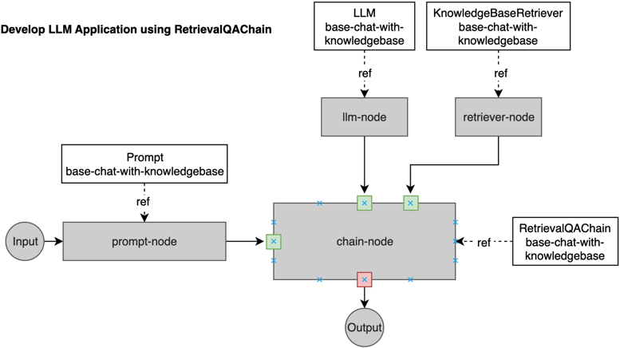

Here are some web based applications built using streamlit.

## Simple chat application - English teacher

* application definition: refer to config/samples/app_llmchain_englishteacher.yaml
* application code: examples/app-ui-using-streamlit/chat_app_english_teacher.py
* application name: base-chat-english-teacher
* application namespace: kubeagi-system

See details about [how it works](./llm-workflow-llmchain.md)

## Chat application using private knowledgebase

* application definition: refer to config/samples/app_retrievalqachain_knowledgebase.yaml
* application code: examples/app-ui-using-streamlit/chat_using_private_knowledgebase.py
* application name: base-chat-with-knowledgebase
* application namespace: kubeagi-system

Here is the workflow described using a chart.

You should update the application definition/code/name/namespace as your requirement, and then just copy the python script to the streamlit application folder and play with it.
