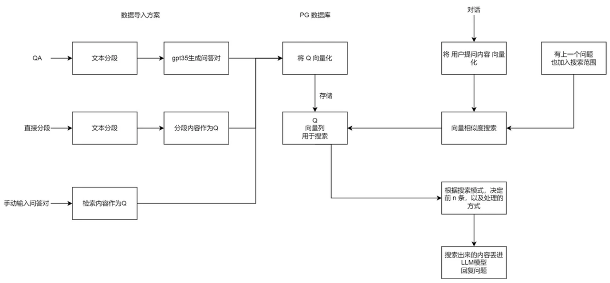

## KubeAGI 介绍
KubeAGI 是一款简单、多样化且安全的一站式 LLMOps 平台，旨在帮助每个人找到人类与人工智能更完美的融合。通过数据管理、数据处理、知识库构建、模型关联和模型应用构建，为企业开发者提供完整的开发平台。降低使用门槛，无开发背景的用户也可通过 KubeAGI 平台快速搭建自己的大模型应用，开箱即用。
### 基本概念
概念    | 说明
:--------: | -----
数据集 | 数据是模型训练、搭建知识库应用的基础，数据的质量影响整个模型效果。平台提供数据集管理功能，将分散的数据进行集中式纳管，可进行数据集的版本控制、数据纳管标准化运行，节省数据集收集和管理成本
Model/模型  | 通常指的是用于处理和理解复杂数据的先进算法和数学框架
LLM  | 大语言模型，是指基于深度学习的模型，专门用于处理、理解和生成自然语言
text-embedding | 文本嵌入模型，是指一种将文本（如单词、短语或句子）转换为数值向量的技术
向量 | 向量可以简单理解为一个数字数组，两个向量之间可以通过数学公式得出一个距离，距离越小代表两个向量的相似度越大。从而映射到文字、图片、视频等媒介上，可以用来判断两个媒介之间的相似度。
Prompt | 提示词，简单的理解成它是给大模型的指令。它可以是一个问题、一段文字描述，甚至可以是带有一堆参数的文字描述。大模型会基于 prompt 所提供的信息，生成对应的文本或者图片

更多概念，可以参考 [AGI 领域的常见词汇及参数](https://dev.tenxcloud.com/t/topic/23)

### 核心功能
<table>
    <tr bgcolor="#999999">
        <td>分类</td>
        <td>功能模块</td>
        <td>功能说明</td>
   </tr>
    <tr>
        <td rowspan="3">数据管理</td>
        <td >数据集管理</td>
        <td>包含：列表、新建数据集、数据集详情、删除数据集等功能，其中数据集包含多版本管理</td>
    </tr>
    <tr>
        <td>数据处理</td>
        <td>数据处理能力，列表、包含：新建任务、任务详情、删除任务等功能，任务支持对数据做异常清洗、数据隐私处理等能力</td>
    </tr>
    <tr>
        <td>知识库管理</td>
        <td>包含：列表、新建知识库、知识库详情、删除知识库等功能</td>
    </tr>
    <tr>
        <td rowspan="2">模型管理</td>
        <td>模型仓库</td>
        <td>包含：列表、新建模型、模型详情、删除模型等功能，其中模型包含多版本管理</td>
    </tr>
    <tr>
        <td>模型服务</td>
        <td>包含：列表、新建模型服务、模型服务详情、删除模型服务等功能</td>
    </tr>
    <tr>
        <td>应用管理</td>
        <td>模型应用</td>
        <td>构建自己的大模型应用，比如以对话的方式同 LLM 应用进行交互，订阅实时数据，提高大模型的信息实时性</td>
    </tr>
</table>

### KubeAGI 优势
- 一站式平台，流程完善
KubeAGI 平台包含数据管理、模型管理、应用构建以及对话框，企业开发者可以通过可视化界面实现模型的全生命周期管理，无需其他工具。
- 简单易用
KubeAGI 平台低技术门槛，内置常见通用模型，开箱即用，用户可简单上手，通过少量的数据操作即可获得高性能的模型应用。
- 安全可靠
KubeAGI 平台提供数据清洗能力，对敏感数据、隐私数据等进行过滤处理，确保推理内容安全可信。

### 应用场景
面向不同的企业需求，KubeAGI 提供不同的功能服务。
- 对话沟通
在实际生活中，针对用户需求提供快速应答，精准匹配用户需求，完成营销商拓、及时响应、正向心理辅导等内容，提升客户体验。
- 行业知识库
知识库是指基于云计算环境下建设和管理的知识资料库，包括文档、图片、视频和其他多媒体资源，是现代企业和个人获取知识和信息的主要渠道。KubeAGI 可以应用于各行各业知识库的建设和管理，从而提供更加智能化、个性化的知识服务。
- 企业助手
企业助手支持用户对企业内部信息进行检索，如：企业规章制度、企业产品信息、企业客户信息等。
- 内容创作
AGI 可以通过自然语言处理、机器学习和深度学习等技术，自动分析和生成各种类型的文档，如报告、合同、说明书等。智能文档生成可以提高文档生成的效率、准确性和个性化。

### 知识库结构
* 向量
如果我们直接传给计算机一段文字内容，计算机是无法直接理解的，向量是计算机理解两段文字是否有相似性、相关性其中的一种方式，因为向量可以把文字转成计算机可以理解的语言。
向量可以简单理解为一个数字数组，两个向量之间可以通过数学公式得出一个距离，距离越小代表两个向量的相似度越大。从而映射到文字、图片、视频等媒介上，可以用来判断两个媒介之间的相似度。
而由于文字是有多种类型，并且拥有成千上万种组合方式，因此在转成向量进行相似度匹配时，很难保障其精确性。在向量方案构建的知识库中，通常使用topk召回的方式，也就是查找前k个最相似的内容，丢给大模型去做更进一步的语义判断、逻辑推理和归纳总结，从而实现知识库问答。因此，在知识库问答中，向量搜索的环节是最为重要的。
影响向量搜索精度的因素非常多，主要包括：向量模型的质量、数据的质量（长度，完整性，多样性）、检索器的精度（速度与精度之间的取舍）。与数据质量对应的就是检索词的质量。
### KubeAGI 知识库原理
将文本内容拆分为 QA，只用 Q 来和用户输入做向量匹配，使得检索内容更精准。
生成问答对时，支持用户手动选择模型，图中 GPT 3.5 仅是示例。

  

### 提高搜索精准度的方法
- 更好分词分段：当一段话的结构和语义是完整的，并且是单一的，精度也会提高。因此，许多系统都会优化分词器，尽可能的保障每组数据的完整性。
- 优化检索词：在实际使用过程中，用户的问题通常是模糊的或是缺失的，并不一定是完整清晰的问题。因此优化用户的问题（检索词）很大程度上也可以提高精度。
- 微调向量模型：由于市面上直接使用的向量模型都是通用型模型，在特定领域的检索精度并不高，因此微调向量模型可以很大程度上提高专业领域的检索效果。

### 内置模型说明
#### 模型分类
模型分类    | 说明
-------- | -----
LLM | 大语言模型
embedding  | 在自然语言处理（NLP）领域中，Embedding通常指的是将单词、短语或句子映射到一个低维向量空间的过程，可以将文本中的离散符号（例如单词或字符）转换为连续的、稠密的向量表示，便于进行语义相似度的比较

#### 内置基础模型

基础模型    | 模型分类 |模型说明
-------- | ----- | -----
baichuan2-7b | LLM & embedding |百川智能推出的新一代开源大语言模型，采用2.6万亿Tokens的高质量语料训练，在权威的中文和英文 benchmark 上均取得同尺寸领先的效果，该版本为70亿参数规模的Chat版本。
chatglm2-6b | LLM & embedding |chatglm2-6b	LLM	智谱AI与清华KEG实验室发布的中英双语对话模型，具备强大的推理性能、效果、较低的部署门槛及更长的上下文，在MMLU、CEval等数据集上相比初代有大幅的性能提升。
qwen-7b-chat | LLM & embedding	| 通义千问是开源的大语言系列模型,由阿里云推出。亮点: 训练数据覆盖多语言(当前以中文和英文为主),总量高达3万亿token。在相关基准评测中,Qwen 系列模型拿出非常有竞争力的表现,显著超出同规模模型并紧追一系列最强的闭源模型。Qwen-Chat 具备聊天、文字创作、摘要、信息抽取、翻译等能力,同时还具备一定的代码生成和简单数学推理的能力。针对LLM对接外部系统等方面优化,具备较强的工具调用能力,以及最近备受关注的 Code Interpreter 的能力和扮演 Agent 的能力。
llama2-7b | LLM & embedding	 |	LLM	由Meta AI研发并开源的7B参数大语言模型，在编码、推理及知识应用等场景表现优秀。
m3e	| embedding	| M3E 是 Moka Massive Mixed Embedding 的缩写 Moka，此模型由 MokaAI 训练，开源和评测，训练脚本使用 uniem ，评测 BenchMark 使用 MTEB-zh Massive，此模型通过千万级 (2200w+) 的中文句对数据集进行训练 Mixed，此模型支持中英双语的同质文本相似度计算，异质文本检索等功能，未来还会支持代码检索 Embedding，此模型是文本嵌入模型，可以将自然语言转换成稠密的向量。
bge-large-zh | embedding	|由智源研究院研发的中文版文本表示模型，可将任意文本映射为低维稠密向量，以用于检索、分类、聚类或语义匹配等任务，并可支持为大模型调用外部知识。