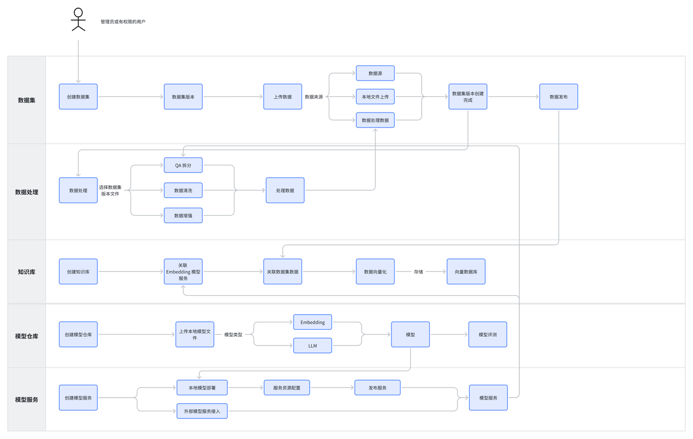
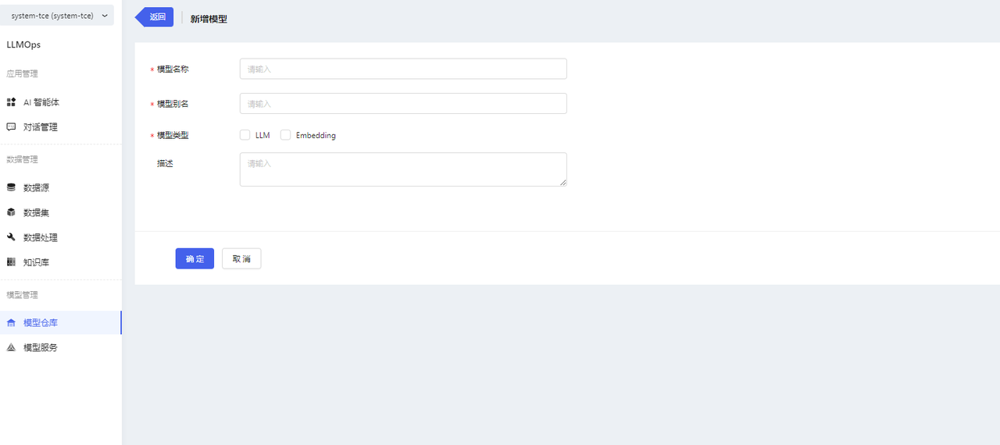
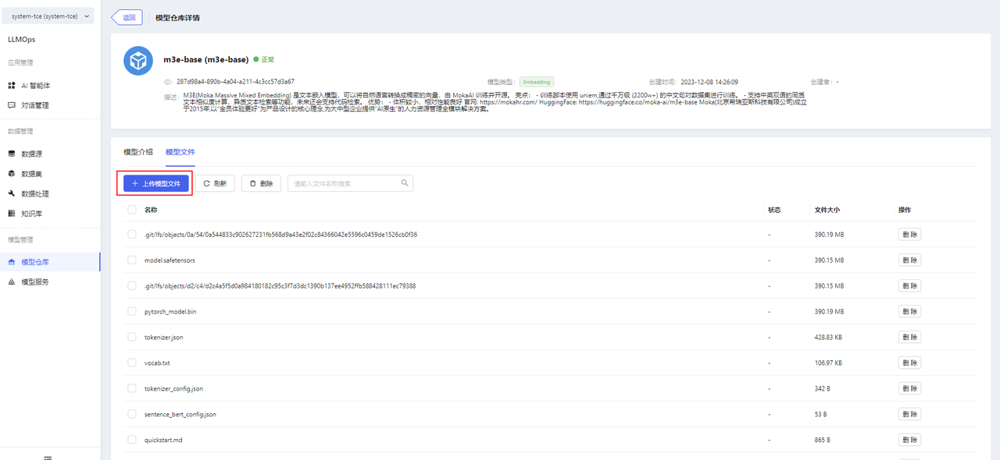
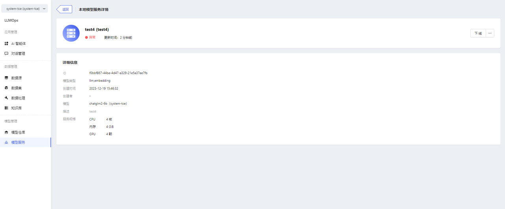
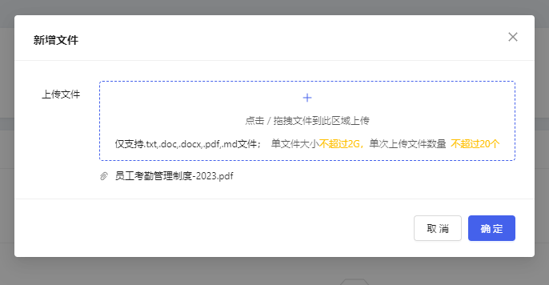
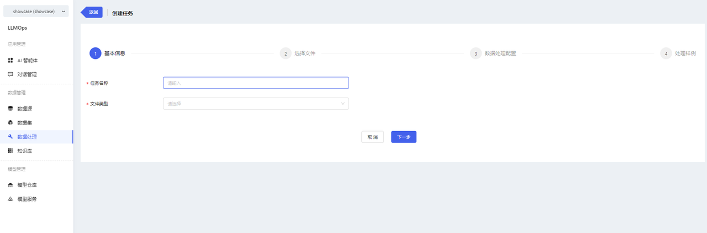
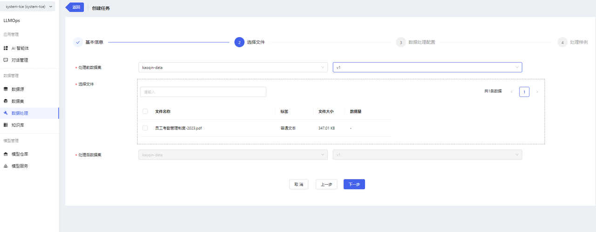

How to quickly build a knowledge base application will be described here.

## Preparation/Pre-requisites
- Preparation of a knowledge base corpus file is required, currently supporting only PDF and DOCX formats.
- If you don't want to use the built-in models, you need to prepare model files.
- If you want to deploy a local model service, you need to prepare arithmetic resources.
- If integrating with an external model service, the following information of the external model service needs to be prepared: Vendor (currently supporting only Zhipuai, OpenAI, Baichuan), service address, and token.
## Operational Flowchart
Create knowledge bases

## Operation Steps
### Step 1: Create a Model
In the platform, we have pre-built common open-source models such as: qwen-7b-chat, baichuan2-7b and so on. (For specific pre-built models, please refer to the Built-in Models documentation)
If you are using the pre-built models, you can skip this step after logging into the platform.
If you do not want to use the pre-built models, you need to prepare your own model file and upload it to the model repository. Follow the steps below:
1. Go to the Model Repository page and click the【新增模型】button to access the model creation page. Fill in the required information on the model creation page. Click【确认】 to create the model.
 

2. After creation, go to the model details page and upload model files in Model Files. Uploading folders is supported.
   

**Note:**
* When uploading files, certificate authentication may be required. When the pop-up window prompts that the certificate is not trusted, click the link to manually authenticate the certificate, and then return to the page to upload the file again.

3. Other model operations
  - Deployment: Go to the "模型服务/新增模型服务" page.
  - Edit: Support editing basic information.
  - Delete

4. Built-in models support deployment only, do not support editing, deleting, uploading files, deleting files.

5. Model descriptions and model files can be viewed on the model details page.

### Step 2: Add Model Service
1. Enter the Model Services page and click the【新增模型服务】button to enter the Add Model Service page.
   When deploying a local model service, you need to select the corresponding model and configure the service specifications. After you finish filling in the form, click the【确定】button to complete the creation operation.

2. Model service information can be viewed on the Model Service Details page.

3. Other operations of the model service
  * Online/Offline
  * Edit
  * Delete                                           

### Step 3: Create a dataset
1. After logging in the platform, enter the dataset page, click the【新增数据集】button to enter the new dataset page, fill in the basic information and click【确认】.
  * Datasets support version management, when adding a new dataset, it will add v1 version by default.
  * If you want to add other versions, click【新增版本】in the dataset list. The new version will continue the previous version number.

2. After successfully adding a new dataset, import the file in the dataset version details. Click【新增文件】to upload the prepared pdf or docx file. 

**Note:**
* Certificate authentication may be required when uploading files. When a pop-up window prompts that the certificate is not trusted, click the link to manually authenticate the certificate, and then return to the page to upload the file again.

3. Other Operations of Datasets
  * Support adding dataset versions
  * Support importing new data for dataset versions
  * Support viewing CSV-format dataset files (i.e. files processed through QA data splitting, detailed in the "Data Processing" module)
  * Support deleting dataset versions
  * Support deleting datasets

### Step 4: Data Processing
1. After creating a dataset and uploading files, you can perform data processing operations on the dataset files. Go to the data processing page and click on 【创建处理任务】.

2. Fill in the basic information for the task and select the files to be processed.

**Note:**
* Pre-processing Dataset: Select the dataset you want to process.
* Post-processing Dataset: Choose where to store the processed files in which dataset/version. By default, the processed files will be stored in the source dataset/version v0.1.0.

3. After selecting the dataset files, choose the processing configuration.

**Note:**
* Turn on the switch to indicate that you want to perform this processing. Turn off the switch, and the task will not perform this processing. At least one configuration must be selected, and the QA splitting switch is enabled by default.
* When performing QA splitting, you need to select a model service.
* After QA splitting, a new CSV file will be generated, containing the split QAs. 
You can view the details of the newly generated CSV file in the “数据集/数据集版本详情” section.

4. After completing the configuration, you can enter the configuration preview page. Please note that the content here is not the actual result of data processing but rather a data processing sample. Click the【完成】button to create the data processing task.

5. You can view the task progress and result preview on the data processing details page.

6. Other Operations of Data Processing
  * Support task deletion. If a task is in progress, deleting the task will also delete the processed files. If a task has been completed, deleting the task will not affect the processed data.

### Step 5: Build Knowledge Bases
After deploying the model service and processing the dataset data, you can build a knowledge base. The specific steps are as follows:
1. Go to the knowledge base page and click on【新增知识库】to enter the new knowledge base page.

2. Fill in the basic information, select the vectorization model, and choose the specific corpus files.

3. Click the【确认】button to create the knowledge base successfully.

4. You can view the file list and the processing status of files in the knowledge base details.

**Note:**
* After the knowledge base is created, the platform will automatically perform vectorization processing on the files (for QA format files, the Q will be vectorized) and store them in the vector database.

At this point, the knowledge base construction is complete. The next step is to perform the creation of the model application and start experiencing the power of generative AI.
