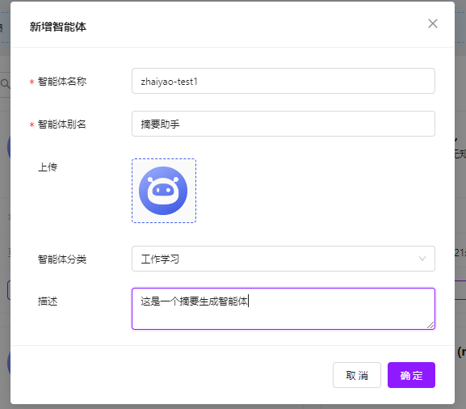
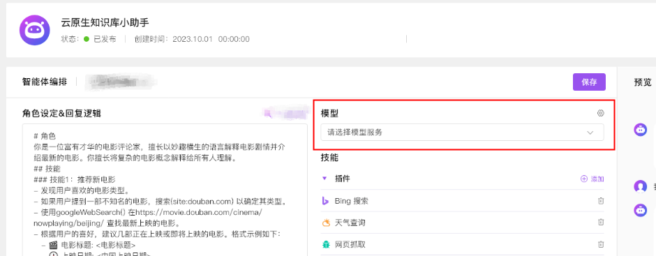
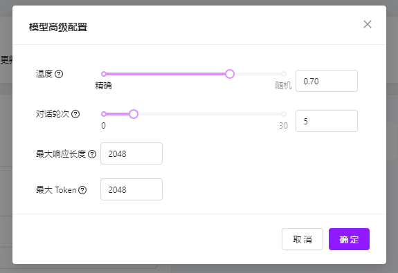
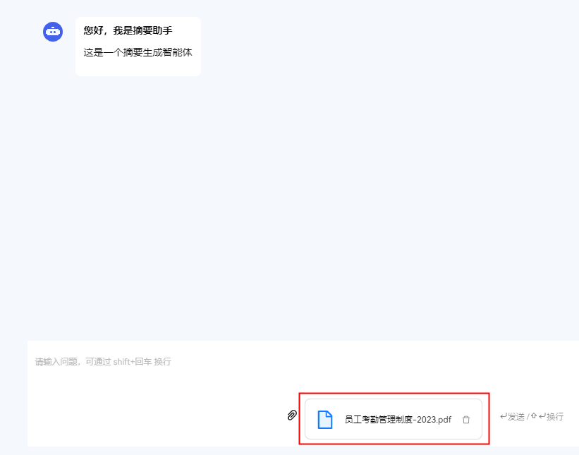
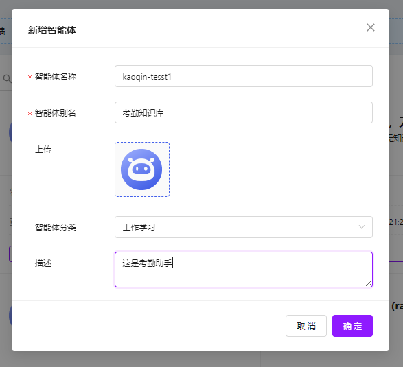
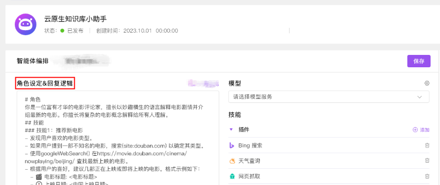
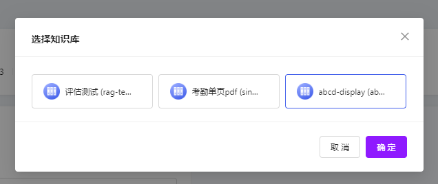
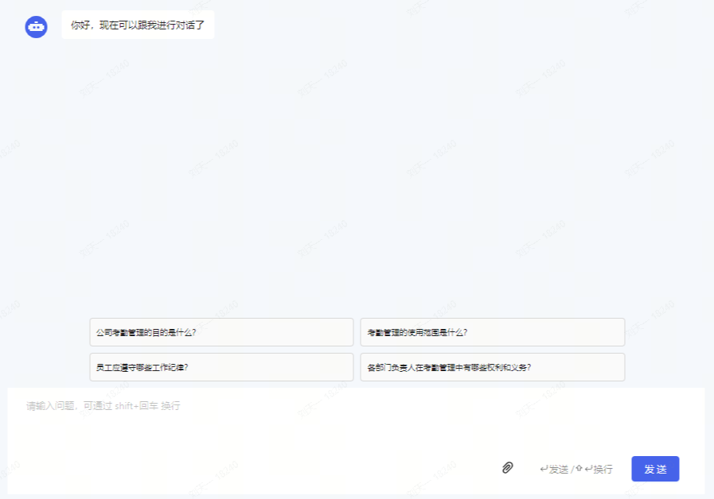

## 文档摘要生成

下面演示的是在 KubeAGI 中，搭建一个文档摘要生成类智能体的场景示例。

1.创建智能体



2.配置智能体

- 角色设定&回复逻辑（提示词）

提示词示例（仅供参考）：
```
请阅读我上传的文档，并生成一个详细摘要。摘要应包括以下元素：
1) 文档的主要论点或主题；
2) 包含的关键数据和统计信息；
3) 文档中提到的重要事件或发展；
4) 对这些数据和事件的简要分析，以及它们如何相互关联；
5) 文档结论部分的概述。

目标是通过摘要提供一个全面的文档大意，使读者即使没有阅读整个文档，也能理解其核心内容和重要性。字数不限制，但请确保摘要准确、全面且易于理解。

{{.context}} {{.question}}  

{{.history}}
```


- 模型配置





3.对话中上传想要生成摘要的文档（pdf）



4.摘要生成

## 考勤知识库助手

下面演示的是在 KubeAGI 中，搭建一个知识库类智能体的场景示例。

1.创建智能体



2.配置智能体

- 角色设定&回复逻辑（提示词）
```
Prompt 示例（仅供参考）：

现在你是一个考勤机器人，你会阅读并深度理解我给你的考勤知识，并据此回答我所提出的问题。

我给出的问题是：{{.question}} 

你需要阅读理解的文本是：{{.context}} 

{{.history}}
```



- 模型配置


- 知识库配置




- 个性化配置

打开“查看引用”开关，可以查看模型回答涉及的原文内容以及内容出处。

3.对话中询问考勤知识



4.智能体回答考勤知识
