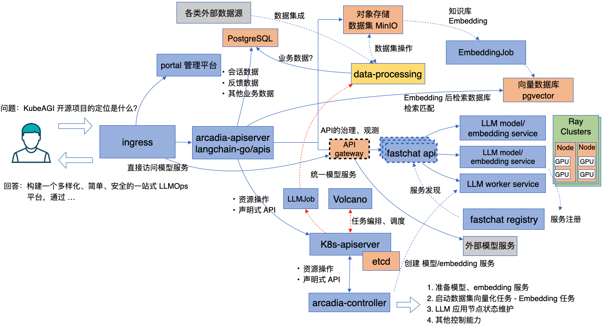

这个主题将涵盖 KubeAGI 的整体技术架构。

关于技术架构，您可以参考下面的图片：

### Ingress
KubeAGI 使用 Kubernetes Ingress Gateway 作为负载均衡器（LB）来进行基本的路由和负载均衡。您可以使用 Ingress Nginx 或其他 Ingress 实现。
### Portal
这是 KubeAGI 的 Web 控制台，它基于 KubeBB 构建，并使用 Yunti 低代码引擎。 详情请参阅 [此处](http://kubebb.k8s.com.cn/docs/develop-guid/lowcode-development/intro)。

### Arcadia-apiserver/Langchain-go
它用于为 LLMOps 提供业务 API，包括：
* 使用 GraphQL API 与后端的 Restful API 进行交互。
* [langchain-go](https://github.com/tmc/langchaingo) 是一个使用 Go 语言编写的项目，具有与 [langchain-python](https://github.com/langchain-ai/langchain) 类似的功能。

### PostgreSQL
用于处理矢量数据 (pgvector) 并持久化一些业务数据。

### MinIO
用于存储各种模型和数据集的文件。

### Data Processing
一个用于数据处理的组件，包括数据清洗、数据分割和自动生成问答的功能。

### API(AI) Gateway
用于各种模型服务，包括 OpenAI API 或其他模型服务。它提供 API 生命周期管理、API 治理和 API 观测（日志记录、监控、追踪）功能。

### Fastchat-api & Fastchat-registry
* FastChat API：一个允许用户与已部署的聊天机器人模型进行交互的 API，可以根据输入消息生成响应。它提供了一个可以通过编程方式访问的 RESTful 接口。该 API 支持各种端点和方法，用于发送消息、获取响应和管理模型配置。
  
* FastChat Registry：充当一个中央存储库，用于管理和组织聊天机器人模型。它提供了一个可用模型的目录，包括它们的描述、版本和其他相关元数据。注册表允许用户搜索特定模型，探索其功能，并获取在 FastChat API 中使用它们所需的信息。
  
  [详情请参阅 github](https://github.com/lm-sys/FastChat)

### Ray Clusters
一个分布式计算框架，提供了一系列功能来执行分布式工作负载，包括分布式推理。

### Arcadia-controller/Arcadia-apiserver
作为一个 Kubernetes 控制器，它可以保持所有 LLMOps CRD 处于所描述的状态。