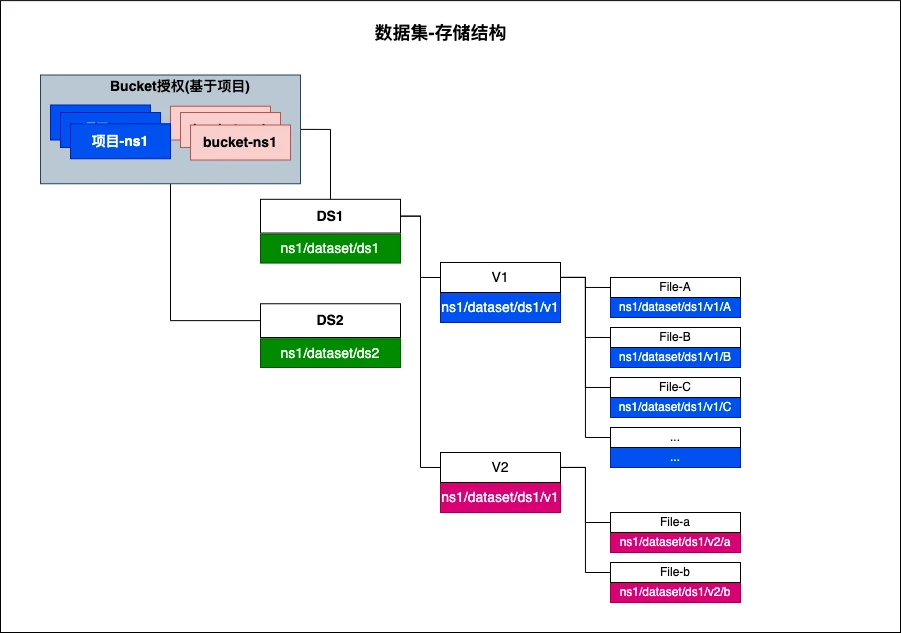

数据集是对可用数据的统一管理，包括训练数据集、知识库数据集等。它支持独立的版本迭代，可以进行数据查看和更新。

## 简介
数据集代表用户纳管的一组相关属性的文件，采用相同的方式进行数据处理，并用于后续的模型训练、知识库等数据的管理。

### 相关功能
* 支持多种类型数据:
    - 文本
    - 图片
    - 视频
* 单个数据集仅允许包含同一类型文件，不同类型文件将被忽略
* 数据集允许有多个版本，数据处理针对单个版本进行
* 数据集某个版本完成数据处理后，数据处理服务需要将处理后的存储回 ```版本数据集```

## 资源抽象
通过两个CRD来实现数据集管理能力: 
* CRD Dataset: 定义数据集全局参数，如:
    - 数据集数据类型
    - 应用场景
    - 创建者
    - 展示名
* CRD VersionedDataset: 定义版本相关的参数，如
    - 数据集
    - 版本号
    - 版本数据集下纳管的文件列表

数据集数据存储在系统数据源中，存储结构如下:


## 功能实现

### 一. 文件上传
文件上传分为4个步骤
1. 调用 get_chunks 获取已经上传的块。如果是新的文件，返回值 uploadid 是空字符串，否则会有值；
   如果第一部返回的 uploadid 是空，需要调用 new_multipart，获取 uploadid。
2. 根据得到 uploadid 调用 get_multipart_url 获取每个分块的上传 url；
   得到 url 后，直接 PUT，body 就是文件的内容进行上传。
3. 每个分块都上传完成后，调用 complete_multipart 让后端完成分块的合并。
4. 调用 update_chunk，更新后端存储的上传进度。
