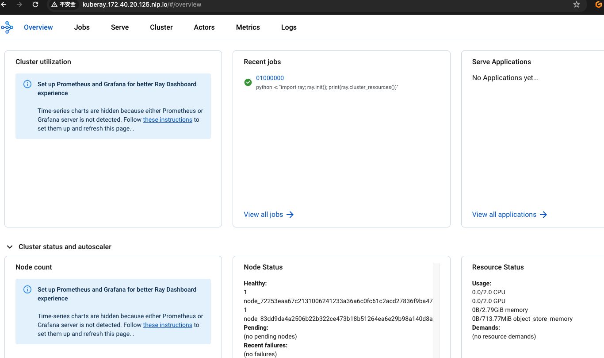

如果我们需要使用分布式推理能力，按照以下步骤安装 Ray：

## 部署一个 Ray 集群

* 详情请参阅 [Ray Quick Start](https://docs.ray.io/en/master/cluster/kubernetes/getting-started/raycluster-quick-start.html) 
* 详情请参阅 [Ray Cluster Concepts](https://docs.ray.io/en/master/cluster/key-concepts.html) 

```
# Note: the images below for vLLM and Ray integration:
# for fastchat worker
# kubeagi/arcadia-fastchat-worker:vllm-v0.1.0
# for head of ray cluster
# kubeagi/ray-ml:2.9.0-py39-vllm
```

1. 部署 kuberay opeartor

```shell
helm repo add kuberay https://ray-project.github.io/kuberay-helm/
helm repo update

# Install both CRDs and kuberay operator v1.0.0.
helm install kuberay-operator -n kuberay-system kuberay/kuberay-operator --version 1.0.0

# Confirm that the operator is running in the namespace `kuberay-system`.
kubectl get pods -n kuberay-system
# NAME                                READY   STATUS    RESTARTS   AGE
# kuberay-operator-7fbdbf8c89-pt8bk   1/1     Running   0          27sray-operator
#
```

2. 部署一个 kuberay 集群

使用以下 yaml 创建一个 ray 集群，并根据需要更新值。确保 head 和 worker 节点具有可调度的 GPU 资源。
* 默认情况下，不会部署任何 worker，我们只需要一个 head 节点来管理 Ray 集群。
* 对于 ray 集群，所有成员必须具有相同的模型文件，在启动模型之前，请在每个成员上准备好模型文件。

```yaml
apiVersion: ray.io/v1
kind: RayCluster
metadata:
  name: raycluster-kuberay
  namespace: kuberay-system
spec:
  headGroupSpec:
    rayStartParams:
      dashboard-host: 0.0.0.0
    template:
      metadata:
        labels:
          app.kubernetes.io/instance: raycluster
          app.kubernetes.io/name: kuberay
      spec:
        containers:
        - image: kubeagi/ray-ml:2.9.0-py39-vllm
          name: ray-head
          resources:
            limits:
              cpu: "1"
              memory: 2G
              nvidia.com/gpu: 1
            requests:
              cpu: "1"
              memory: 2G
              nvidia.com/gpu: 1
          volumeMounts:
          - mountPath: /tmp/ray
            name: log-volume
        volumes:
        - emptyDir: {}
          name: log-volume
  workerGroupSpecs:
  - groupName: workergroup
    replicas: 0
    minReplicas: 0
    maxReplicas: 5
    rayStartParams: {}
    template:
      metadata:
        labels:
          app.kubernetes.io/instance: raycluster
          app.kubernetes.io/name: kuberay
      spec:
        containers:
        - image: kubeagi/ray-ml:2.9.0-py39-vllm
          name: ray-worker
          resources:
            limits:
              cpu: "1"
              memory: 1G
              nvidia.com/gpu: 1
            requests:
              cpu: "1"
              memory: 1G
              nvidia.com/gpu: 1
          volumeMounts:
          - mountPath: /tmp/ray
            name: log-volume
        volumes:
        - emptyDir: {}
          name: log-volume
```

创建 RayCluster 资源并检查状态。
```shell
kubectl apply -f <yaml-above> -n kuberay-system
# Once the RayCluster CR has been created, you can view it by running:
kubectl get rayclusters -n kuberay-system

# NAME                 DESIRED WORKERS   AVAILABLE WORKERS   STATUS   AGE
# raycluster-kuberay   1                 1                   ready    72s

# View the pods in the RayCluster named "raycluster-kuberay"
kubectl get pods -n kuberay-system --selector=ray.io/cluster=raycluster-kuberay

# NAME                                          READY   STATUS    RESTARTS   AGE
# raycluster-kuberay-head-vkj4n                 1/1     Running   0          XXs
# raycluster-kuberay-worker-workergroup-xvfkr   1/1     Running   0          XXs
```

## 使用 ingress 公开 ray dashboard
* 确保您在 Kubernetes 集群中已部署 Nginx Ingress。

使用下面的 yaml 创建 ingress 资源:
```yaml
apiVersion: networking.k8s.io/v1
kind: Ingress
metadata:
  annotations:
    description: ray-head-ingress
    displayName: ray-head-ingress
    httpSend: /
    ingress-lb: portal-ingress
    kubernetes.io/ingress.class: portal-ingress
    nginx.ingress.kubernetes.io/enable-access-log: "false"
    nginx.ingress.kubernetes.io/enable-rewrite-log: "false"
    nginx.ingress.kubernetes.io/load-balance: round_robin
    nginx.ingress.kubernetes.io/proxy-body-size: 102400m
    nginx.ingress.kubernetes.io/proxy-buffering: "on"
    nginx.ingress.kubernetes.io/proxy-connect-timeout: "60"
    nginx.ingress.kubernetes.io/server-alias: ""
    nginx.ingress.kubernetes.io/ssl-redirect: "true"
    nginx.ingress.kubernetes.io/upstream-vhost: $host
  name: ray-head-ingress
  namespace: kuberay-system
spec:
  rules:
  - host: kuberay.<ingress-nginx-ip-address>.nip.io
    http:
      paths:
      - backend:
          service:
            name: raycluster-kuberay-head-svc
            port:
              number: 8265
        path: /
        pathType: Prefix
```

然后，您可以从浏览器中的 ```kuberay.<ingress-nginx-ip-address>.nip.io``` 访问ray dashboard。
  


## 注意事项

1. kuberay raycluster 的更新非常有限：
```
* 只更新 replicas 和 workersToDeleteUpdate 字段, 不支持更新 RayCluster 清单中的其他字段。特别是不支持更新 Ray head pod 和 Ray worker pod 的配置。
* 要更新 pod 配置，请删除 RayCluster，编辑其配置，然后重新创建集群。换句话说，使用 kubectl delete 和 kubectl create 来更新 RayCluster 的 pod 配置，而不是使用 kubectl apply。
* 支持 pod 配置的原地更新在 KubeRay 问题 [#527](https://github.com/ray-project/kuberay/issues/527) 中进行跟踪。
```
