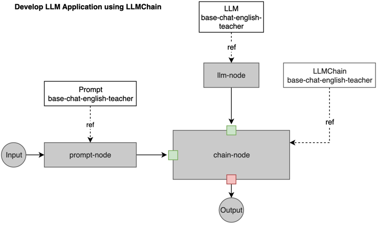

我们将介绍如何使用 LLMChain 创建一个简单的 LLM 应用工作流程。

以下是定义工作流程的 yaml 文件，您可以从 https://github.com/kubeagi/arcadia/blob/main/config/samples/app_llmchain_englishteacher.yaml 中获取完整文件。
```yaml
apiVersion: arcadia.kubeagi.k8s.com.cn/v1alpha1
kind: Application
metadata:
  name: base-chat-english-teacher
  namespace: arcadia
spec:
  displayName: "AI英语老师"
  description: "最简单的应用，AI英语老师"
  prologue: "Hello, I am English Teacher KubeAGI 🤖"
  nodes:
    - name: Input
      displayName: "用户输入"
      description: "用户输入节点，必须"
      ref:
        kind: Input
        name: Input
      nextNodeName: ["prompt-node"]
    - name: prompt-node
      displayName: "prompt"
      description: "设定prompt，template中可以使用{{xx}}来替换变量"
      ref:
        apiGroup: prompt.arcadia.kubeagi.k8s.com.cn
        kind: Prompt
        name: base-chat-english-teacher
      nextNodeName: ["chain-node"]
    - name: llm-node
      displayName: "zhipu大模型服务"
      description: "设定质谱大模型的访问信息"
      ref:
        apiGroup: arcadia.kubeagi.k8s.com.cn
        kind: LLM
        name: base-chat-english-teacher
      nextNodeName: ["chain-node"]
    - name: chain-node
      displayName: "llm chain"
      description: "chain是langchain的核心概念，llmChain用于连接prompt和llm"
      ref:
        apiGroup: chain.arcadia.kubeagi.k8s.com.cn
        kind: LLMChain
        name: base-chat-english-teacher
      nextNodeName: ["Output"]
    - name: Output
      displayName: "最终输出"
      description: "最终输出节点，必须"
      ref:
        kind: Output
        name: Output
---
apiVersion: prompt.arcadia.kubeagi.k8s.com.cn/v1alpha1
kind: Prompt
metadata:
  name: base-chat-english-teacher
  namespace: arcadia
spec:
  displayName: "设定英语老师的prompt"
  description: "设定英语老师的prompt ..."
  userMessage: |
    I want you to act as an English translator...
  input:
    kind: "Input"
  output:
    apiGroup: chain.arcadia.kubeagi.k8s.com.cn
    kind: LLMChain
---
apiVersion: chain.arcadia.kubeagi.k8s.com.cn/v1alpha1
kind: LLMChain
metadata:
  name: base-chat-english-teacher
  namespace: arcadia
spec:
  displayName: "llm chain"
  description: "llm chain"
  memory:
    maxTokenLimit: 20480
  input:
    llm:
      apiGroup: arcadia.kubeagi.k8s.com.cn
      kind: LLM
    prompt:
      apiGroup: prompt.arcadia.kubeagi.k8s.com.cn
      kind: Prompt
  output:
    apiGroup: "arcadia.kubeagi.k8s.com.cn"
    kind: "Output"
```
下图显示了节点和引用的资源，可以帮助您理解其工作原理。



yaml 中的属性说明：

* Application - 作为 LLM 应用程序抽象的 Kubernetes CRD。
  * prologue
对话或对话的开头或引言部分

  * nodes
LLM 应用程序中的节点列表。每个节点都有名称、显示名称和描述。ref 是该节点引用的运行时对象，通常应包含种类、名称和可选的 apiGroup。nextNodeName 是下一个要运行的链接节点。

    * Input: LLM 应用的第一个节点，需要用户输入，下一个节点将是 prompt-node。
    * prompt-node: 用于处理来自 Input 节点的提示，并引用 Prompt 资源，下一个节点将是 chain-node。
    * llm-node: 用于声明 LLM 资源，可以链接到使用该 LLM 运行任务的节点，下一个节点将是 chain-node。
    * chain-node: 它指的是 LLMChain 资源，并将 prompt-node 和 llm-node 作为 input。Chain 是 langchain 的核心概念，LLMChain 用于连接 "Prompt "和 "LLM"。下一个节点将是 Output。
    * Output: 声明 LLM 应用程序的结束节点，并接收输出消息。

* Prompt - 作为 LLM 提示抽象的 Kubernetes CRD。
  指提供给大型语言模型（LLM）的初始输入或指令，用于指导其生成文本或响应。
  输入和输出只是为了限制可连接到此提示节点的节点类型，因此在运行时不会使用。

* LLMChain  -作为 LLM chain抽象的 Kubernetes CRD。
  连接并扩展 LLM 的输出，生成连贯且上下文一致的文本序列。一个 LLM 的输出将成为另一个 LLM 的输入或延续，从而创建一个类似链的结构。
  输入和输出只是为了限制可连接到此 LLMChain 节点的节点类型，因此在运行时不会使用。
 
* LLM - LLM 模型服务，如 baichuan-7b、qwen-14b，或嵌入服务，如 bge、m3e。在这里，我们使用 "zhipuai "作为 LLM，并以密文的形式引用 API 密钥。
  因此，Appilcation 资源中的节点就是工作流的定义，它们之间使用 nextNodeName 进行连接。每个节点还引用使用其他资源定义的 K8s 资源，如 Prompt、LLM 和 LLMChain。在运行期间，工作流将按照应用程序定义的方式运行，并使用 Prompt、LLM、LLMChain 资源中指定的数据。

  输入和输出节点是系统内置节点，以便更好地识别工作流的开始和结束，因此没有引用实际资源。

请注意，Application 定义中每个节点的 ref、kind 和 apiGroup 将限制此节点的类型，而名称确定了最终关联的资源。每个 K8s 资源（如 Prompt、LLMChain）中指定的输入和输出仅限制可以由 Application 内部的节点引用的类型，它们可以被不同的 Application 引用。