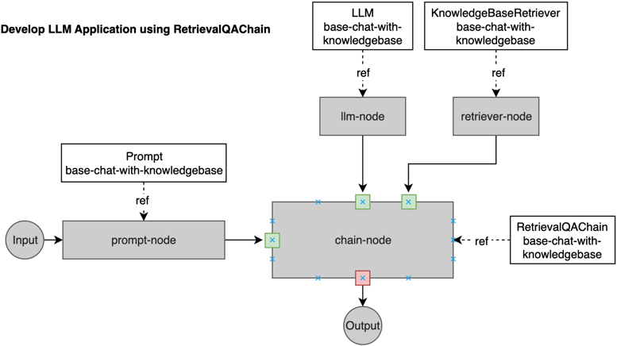

以下是一些使用 streamlit 构建的基于 Web 的应用程序。

关于如何在 KubeAGI 上启用 streamlit，请参阅 [使用 Streamlit 运行 LLM 应用程序](../QuickStart/run-llm-app-using-streamlit.md)

## 简单的聊天应用程序 - English teacher

* 应用程序 definition: 参考 config/samples/app_llmchain_englishteacher.yaml
* 应用程序 code: examples/app-ui-using-streamlit/chat_app_english_teacher.py
* 应用程序 name: base-chat-english-teacher
* 应用程序 namespace: kubeagi-system

详细信息请查看 [应用工作流程 - LLMChain](./llm-app-workflow-llmchain.md)

## 使用私人知识库的聊天应用程序

* 应用程序 definition: 参考 config/samples/app_retrievalqachain_knowledgebase.yaml
* 应用程序 code: examples/app-ui-using-streamlit/chat_using_private_knowledgebase.py
* 应用程序 name: base-chat-with-knowledgebase
* 应用程序 namespace: kubeagi-system

下图描述了工作流程：



您可以根据自己的要求更新应用程序的 definition/code/name/namespace，然后将 python 脚本复制到 streamlit 应用程序文件夹中，并进行测试。

## 使用 curl 工具测试应用程序

可以使用 ```<kubeagi-host>/kubeag-apis``` 访问 KubeAGI API，可以通过 /chat 上下文路径调用聊天模式应用程序。

因此，您可以使用以下类似命令，使用 curl 工具与应用程序聊天：


```shell
curl -k -XPOST https://portal.172.40.20.125.nip.io/kubeagi-apis/chat --data '{"query":"本制度的适用范围包括哪些人员？","response_mode":"blocking","conversion_id":"","app_name":"kaoqin-bge-qwen-model-app", "app_namespace":"your-namespace"}'
```

聊天 API 支持屏蔽和流模式，您可以使用自己喜欢的模式。
