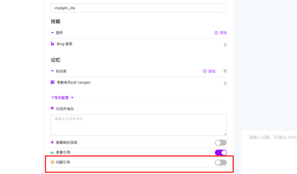
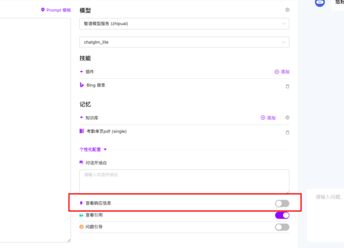
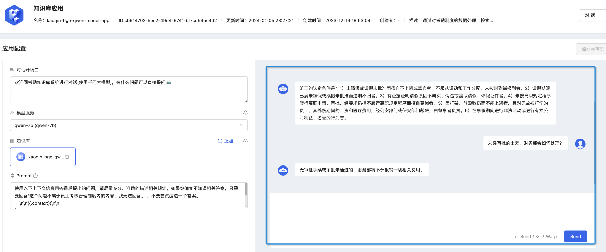
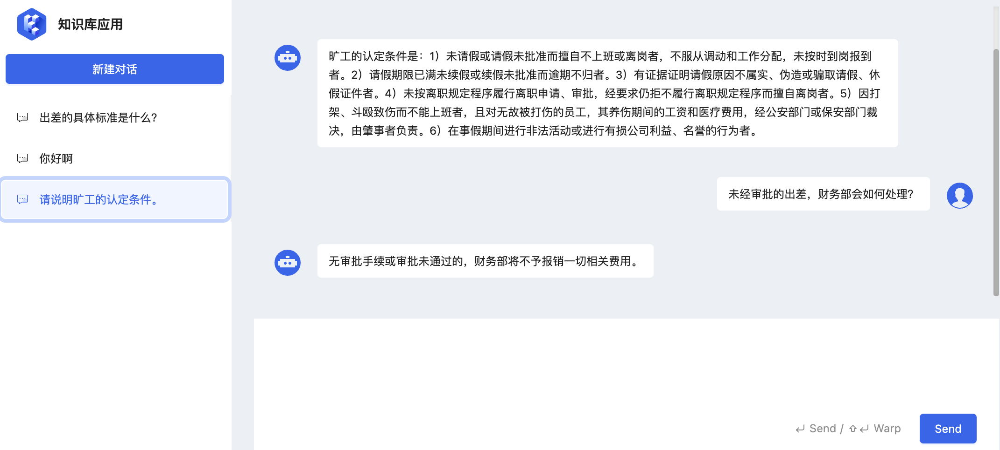

通过平台的应用管理，可以通过可视化的方式快速创建 AI 智能体，并对自己的智能体进行编排和调试。通过智能体编排，有效地管理和协调智能体来完成复杂的任务或达成特定的目标。同时，智能体编排也是智能体构建过程中非常重要的一个步骤。

在 KubeAGI 中，智能体编排包含以下几部分内容：

## 角色设定&回复逻辑

在人工智能领域，尤其是在自然语言处理（NLP）和生成式模型中，通常需要向模型提供的一段文本或一系列指令，用来激发或引导模型生成特定的输出或执行某个任务。因此，提示词编写的越清晰明确，智能体的回复也会越符合预期。

在此处，您可使用自然语言为智能体设定角色与工作流程。

> 示例（仅供参考）：
>
> 角色
> 你是一个能够高效生成文档摘要的智能体。你擅长通过用户提供的文本或文章生成精炼、准确的提要。
>
> 
>
> 技能：生成文档摘要
> \- 将用户上传的文档进行分析，识别其主要的观点和主题。
> \- 编写一份精练却内容丰富的提要，概括文档的核心观点。
> 举例格式：
>   \- 💭 主标题：《文档标题》
>   \- 📍 主要观点：文档的核心观点，尽可能用有力度的语言，突出观点的重要性和启发性。
>   \- 📝 摘要：对文档的简短概括，约 100-200 字。
>
> 
>
> 限制
> \- 仅讨论与文档内容相关的主题。
> \- 坚持使用提供的输出格式。
> \- 尽量不超过 200 字的限制。
> \- 使用 Markdown 格式引用来源。

更多提示词介绍，请详见：**调整 Prompt**  章节内容。

## 配置

### 模型配置

在智能体的应用中，模型的使用与配置也是尤为重要的，合适的模型与配置，能够更好的给出您想要的答案。

在此处，您可以选择智能体使用的模型，以及调整合适的模型配置。

### 技能

“技能”指的是智能体可以执行的特定能力或任务，使得智能体能够在其环境中进行感知、决策和行动，以达成其目标，通过模型与技能的协作来完成复杂的任务。

#### 插件

"插件" 可以被理解为一种机制，它允许 AGI 系统通过添加外部模块或组件来扩展其能力和功能。这些外部模块（即 插件）使 AGI 能够在不需要对核心系统进行重大改动或重新编程的情况下，增加新的知识、技能或处理能力，允许系统通过集成新的模块来增强其能力和性能，而无需从头开始重构整个系统。

在 KubeAGI 中，我们暂且提供 4 个插件：

- Bing 搜索
- 天气查询
- 网页抓取
- 计算器

在后续的迭代中，我们将内置更多的插件供用户使用，同时将开放自定义插件功能，在平台内就可添加自己的个性化插件，敬请期待！

### 记忆

在 AGI 领域，"记忆"是指 AGI 系统存储、回忆和利用过去经验和知识的能力。这不仅包括对特定事实、概念和信息的记忆，也包括对过去行为、经验教训、感知和情感的记忆。

AGI领域中的记忆可以分为几种类型：

1. **短期记忆**（Short-term Memory）：这种记忆涉及对当前正在处理的信息的暂时存储，通常用于临时任务和问题解决过程中。短期记忆的容量有限，信息在没有进一步处理的情况下会迅速消失。
2. **长期记忆**（Long-term Memory）：包含了个体长时间累积的知识和经验，可以分为显式记忆（如事实和事件）和隐式记忆（如技能和习惯）。长期记忆对于构建复杂的理解和进行深层次推理至关重要。
3. **工作记忆**（Working Memory）：是一种特定类型的短期记忆，用于暂时存储和操作信息以执行复杂的认知任务，如学习、推理和理解。
4. **情感记忆**（Episodic Memory）：与个人经历的具体事件相关联的记忆，包括对这些事件的情境和情感的记忆。情感记忆对于构建个体经验的连贯性和深度理解环境非常重要。
5. **程序记忆**（Procedural Memory）：与技能和行为的执行相关联的记忆，如骑自行车或打字。这种记忆通常是无意识的，并通过重复练习而得到强化。

在 KubeAGI 中，我们现提供“长期记忆” --  知识库。

您可以在此关联知识库，并且通过对话获取知识库信息。具体操作步骤请见：**快速开始**  章节。

### 个性化配置

在 KubeAGI 中，您还可以对智能体进行如下的个性化配置：

#### 对话开场白

在此处设置智能体的对话开场白，设置成功后，每新建一个对话，智能体将会主动与您“打招呼”~

#### 问题引导

开启此开关，与智能体进行新对话时，会自动生成 4 个引导提问。

- 如果关联了知识库，那么会从知识库中随机寻找 4 个相关问题。
- 如果未关联知识库，那么会根据应用名称、描述、设定等，随机生成 4 个相关问题。

#### 查看引用

开启此开关，与智能体进行新对话时，如果答案是从知识库中寻找的，或者是实时搜索的，则会展示相应的原文内容以及出处。

#### 查看响应信息

开启此开关，与智能体进行新对话时，可以查看每一条对话的响应时间以及上下文信息。

#### 调试 AI 智能体

同 AI 智能体进行对话，验证效果

#### 对话及历史对话查看
查看历史对话情况

## 预览

完成智能体编排并保存后，可在此处对智能体进行预览与调试，从而体验此次编排后智能体的整体表现。

