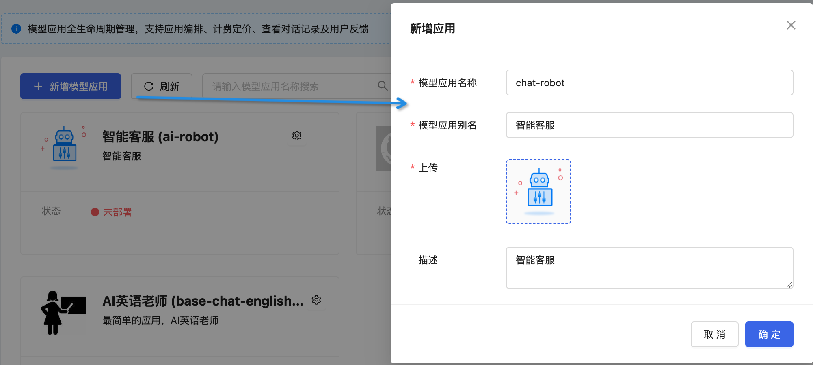
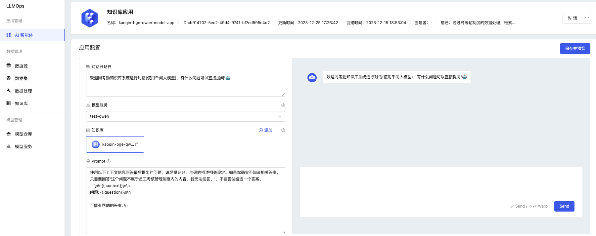

通过平台的应用管理，可以通过可视化的方式快速创建 AI 智能体，并对自己的智能体进行编排和调试。

### 创建 AI 智能体
点击“创建模型应用”，输入应用的相关信息：

### 配置 AI 智能体

AI 智能体支持对以下数据进行配置：
* 对话开场白
* 模型服务
* 知识库
* 提示词（Prompt）

通过“保存并预览”，可以即时的同 AI 智能体进行交互，体验当前配置情况下的回复效率及质量。

通过 yaml 编排的方式生成 AI 智能体，参考 [LLM 应用工作流](../Scenarios/llm-app-workflow-llmchain.md)

### 调试 AI 智能体

同 AI 智能体进行对话，验证效果

### 对话及历史对话查看
查看历史对话情况

