在这里将会介绍如何快速搭建一个知识库智能体。

## 准备工作/前置条件

- 需要准备知识库的语料文件，暂时仅支持 pdf、docx 格式的文件
- 如果您不想使用内置模型，则需要准备模型文件
- 如果要部署本地模型服务，需要准备算力资源
- 如果对接外部模型服务，需要准备外部模型服务的信息，包含：供应商（暂时仅支持 OpenAI、智谱、百川）、服务地址、Token（API Key）

## 操作流程图

创建知识库智能体流程图如图所示：

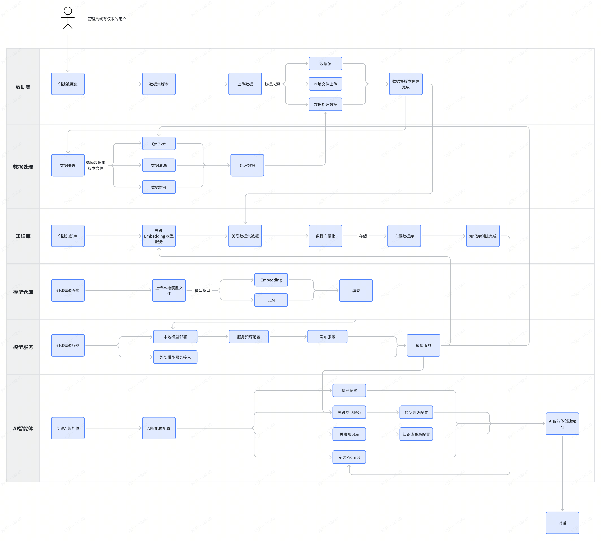

## 操作步骤

### 第一步 创建模型

在平台中，我们会内置常见的开源模型，如：qwen-7b-chat、baichuan2-7b 等（具体内置模型请见：内置模型说明）。

**登录平台后，如果您使用内置模型，则可忽略此步骤；**

如果您不使用内置模型，则需要准备自己的模型文件，并将其上传至模型仓库中。操作流程如下：

1.进入模型仓库页面，点击【新增模型】按钮，进入新增模型页面，填写基本信息后，点击【确认】

2.创建完成后，进入模型详情页面，在模型文件中上传模型文件。支持上传文件夹。

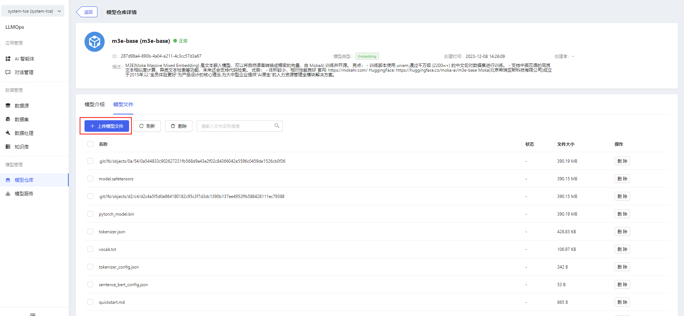

**提示**

上传文件时，可能需要进行证书认证。当弹窗提示证书未受信任时，点击链接手动认证证书，然后返回页面重新上传文件即可。

1.模型其他操作

（1）部署：跳转至“模型服务/新增模型服务”页面

（2）编辑：支持编辑基本信息

（3）删除

2.内置模型仅支持部署，不支持编辑、删除、上传文件、删除文件

3.可在模型详情页面查看模型介绍以及模型文件

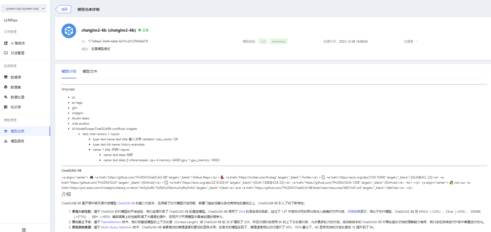

### 第二步 创建模型服务

#### 本地模型部署

进入模型服务页面，点击【新增模型服务】按钮，进入新增模型服务页面。

1.部署本地模型服务时，需要选择对应的模型，以及配置服务规格。完成填写后，点击【确定】按钮，即可完成创建操作。

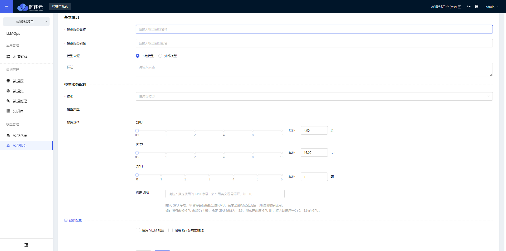

2.可在模型服务详情页面查看模型服务信息

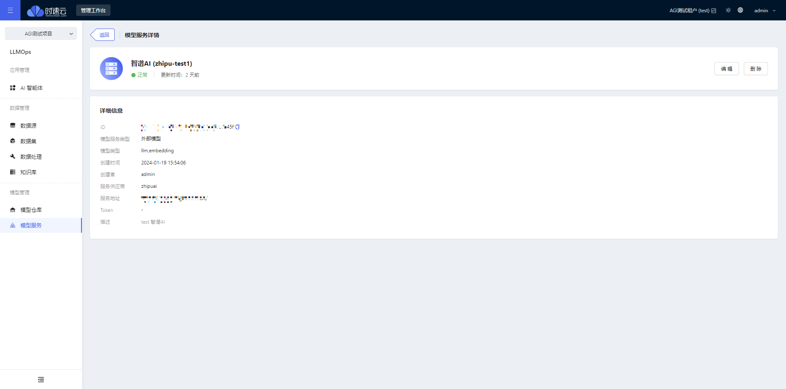

3.本地模型服务其他操作

（1）上线/下线

（2）编辑

（3）删除

#### 外部模型接入

1.进入模型服务页面，点击【新增模型服务】按钮，进入新增模型服务页面。

2.选择“外部模型服务”，填写模型服务基本信息、模型服务供应商、服务地址、API Key（Token），选中该模型服务支持的模型类型（LLM、Reranking、Embedding），点击【测试连接】，通过后点击【保存】，即可添加成功。

支持在本集群上接入其他集群 KubeAGI 上部署的本地模型服务，供应商选择“KubeAGI”，填写服务 API 地址与服务 ID，即可接入。

### 第三步 创建数据集

1.登录平台后，进入数据集页面，点击【新增数据集】按钮，进入新增数据集页面，填写基本信息后，点击【确认】

（1）数据集支持版本管理，新增数据集时，默认会同步新增一个 v1 版本

（2）后续若想新增其他版本，在数据集列表点击【新增版本】即可。新增的版本会延续之前的版本号

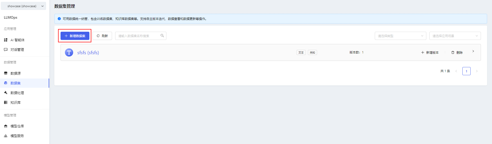

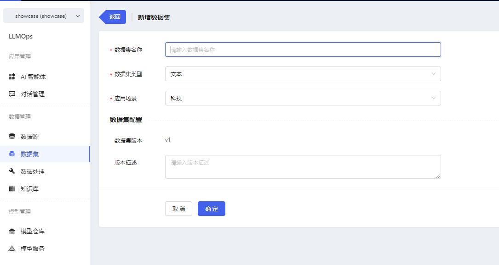

2.新增数据集成功后，在数据集版本详情中进行文件的导入。点击【新增文件】，上传准备好的 pdf 或 docx 文件。

> **提示**
>
> 上传文件时，可能需要进行证书认证。当弹窗提示证书未受信任时，点击链接手动认证证书，然后返回页面重新上传文件即可。

3.数据集其他操作

（1）支持新增数据集版本

（2）支持为数据集版本导入新的数据

（3）支持查看 csv 格式的数据集文件（即经过 QA 拆分数据处理的文件，此内容会在“数据处理”模块详细描述），这样用户可以看到 QA 的拆分详情内容与拆分质量

- 支持删除数据集版本
- 支持删除数据集

### 第四步 数据处理

1.在创建完数据集并上传文件后，可对数据集文件进行数据处理操作。进入数据处理页面，点击【创建处理任务】

2.填写任务基本信息，并选择要处理的文件

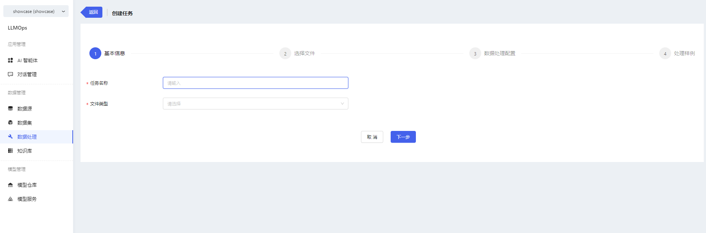

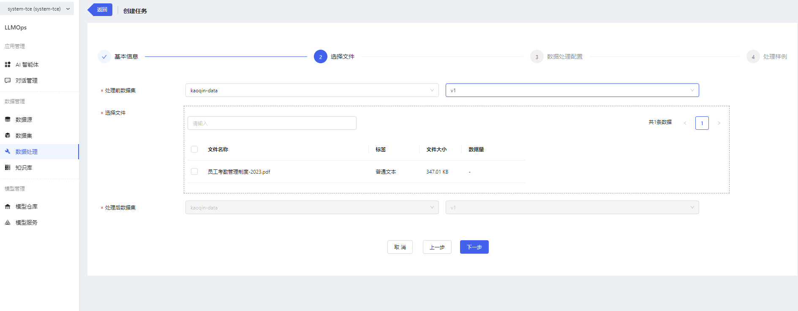

> **提示**
>
> 处理前数据集：选择想要处理的数据集
>
> 处理后数据集：选择将处理后的文件存储到哪一个数据集/版本中，v0.1.0 版本默认存储至源数据集/版本中

3.选择完数据集文件后，选择处理配置

> **提示**
>
> 开启开关，表示要做此项处理，关闭开关，任务将不做此项处理。最少选择一个配置，默认开启 QA 拆分开关。
>
> 做 QA 拆分处理时，需要选择模型服务。
>
> QA 拆分后，将会生成一个新的 csv 文件，其中文件内容为拆分后的 QA 。
>
> 支持在“数据集/数据集版本详情”中查看新生成的 csv 文件详情。
>
> 做 QA 拆分时，需要选择对应的 LLM 模型服务，同时支持 QA 拆分操作的高级配置
>
> - 模型配置：可进行模型温度、最大 Token、Prompt 参数配置
> - 可对 QA 拆分做 QA 去重配置，QA 去重需要选择对应的向量化模型，以及配置相似度阈值。
>
> 什么是 QA 去重？
>
> 平台会对 QA 拆分结果进行比对，对于相似度高的 QA 问答对，仅会保留一条数据。
>
> 
>
> 如何判断重复？
>
> 平台会根据拆分后的完整 QA 内容计算每一条 QA 的相似距离，基于相似距离进行相似度打分，得分越高代表越相似。

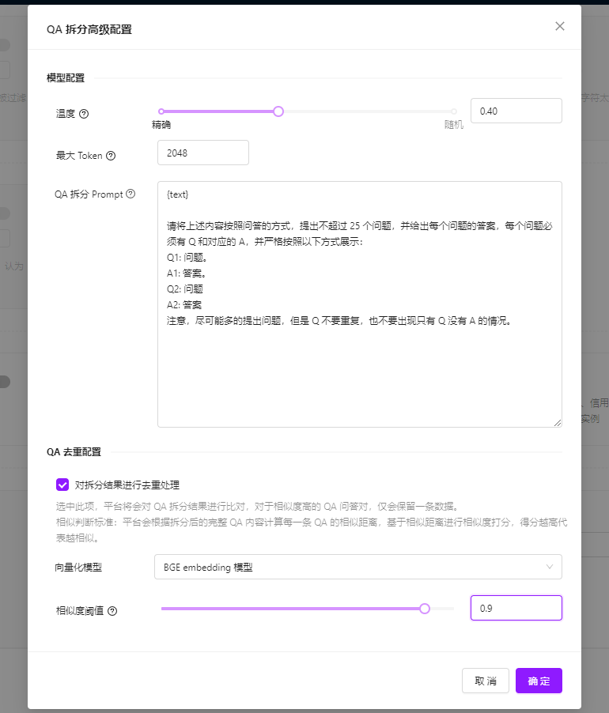

4.完成配置后，可进入配置预览页面，此处内容并非真实数据处理结果，而是数据处理样例。点击【完成】按钮，即可创建数据处理任务。

5.可在数据处理详情页面查看任务进度与结果预览。

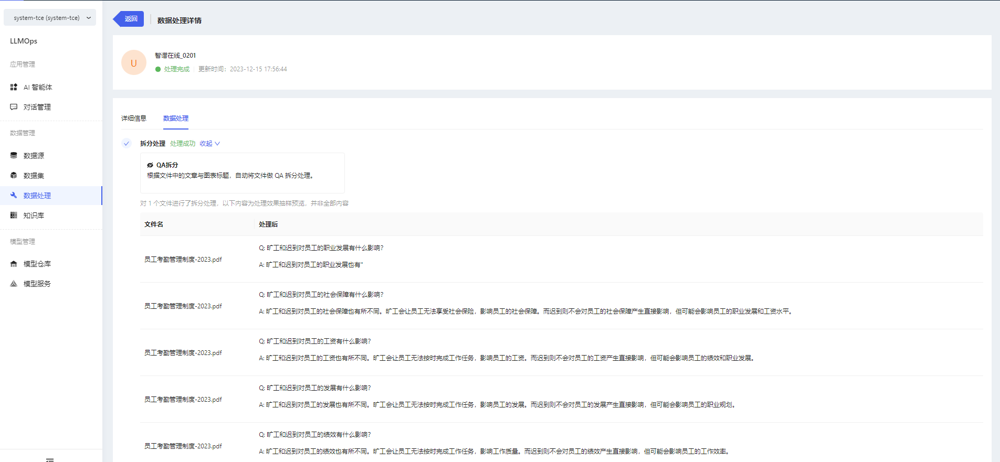

6.数据处理其他操作

支持删除任务。如果任务正在执行中，删除任务后，已处理的文件也将同时删除；如果任务已执行完成，删除任务后，不影响处理后的数据。

### 第五步 搭建知识库

在部署完模型服务、处理完数据集数据后，可进行知识库的搭建，具体步骤如下：

1.进入知识库页面，点击【新增知识库】，进入新增知识库页面

2.填写基本信息，选择向量化模型，选择具体的语料文件

3.点击【确认】按钮，即可创建成功

4.可在知识库详情中查看文件列表以及文件的处理状态

> **提示**
>
> 知识库创建完成后，平台会将文件自动进行向量化处理（QA 格式的文件，会将 Q 向量化），并且存储到向量数据库中。

### 第六步 搭建知识库智能体

完成以上操作步骤，就可以搭建自己的知识库智能体啦！具体搭建步骤如下：

1.进入 AI 智能体页面，点击【新增智能体】，弹出基本信息填写弹窗

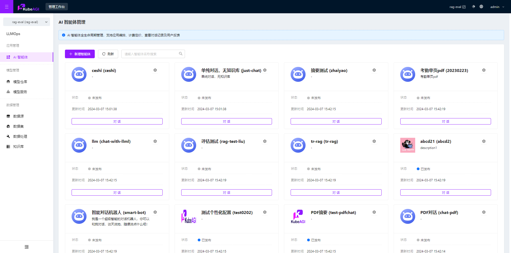

2.填写智能体基本信息，点击确认，进入智能体配置页面

3.进入配置页面后，可进行智能体的角色设定&回复逻辑配置、模型配置、技能配置、记忆配置以及个性化配置。

详细配置内容请见：**智能体编排**  章节内容。

4.完成配置后，点击【保存】，智能体就创建完成啦！您可以在配置页面右侧进行调试，可以看到当前配置下模型的问答效果。

5.点击【对话】按钮，就可以和智能体对话啦！

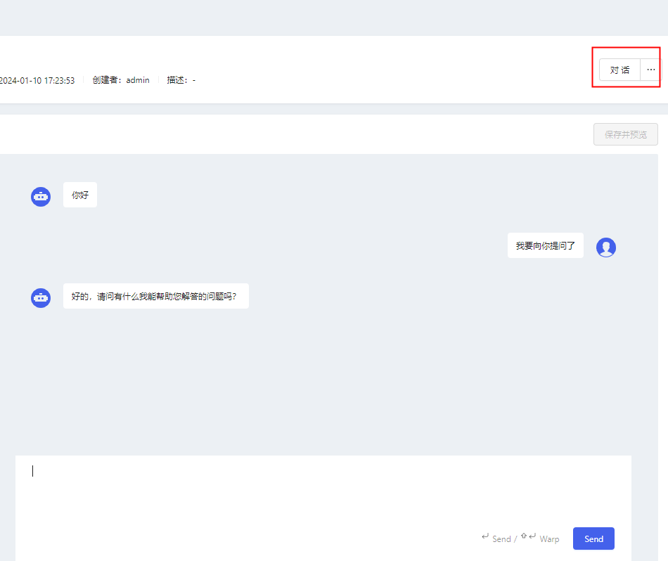

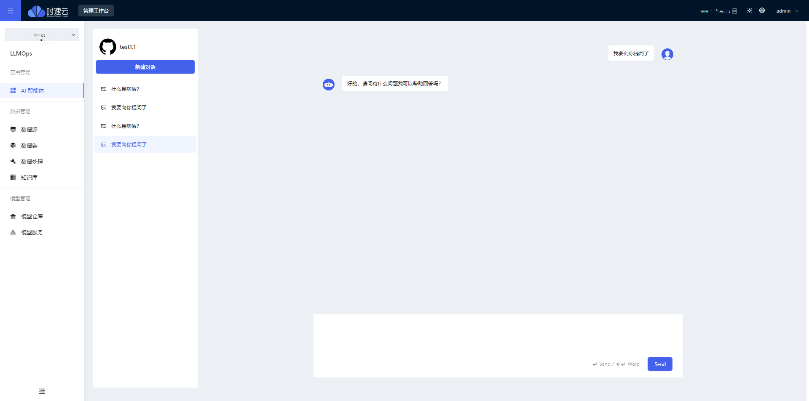

**如果您仅想搭建普通智能体（无需知识库），那么仅需要执行第一步、第二步、第六步操作即可完成搭建！**

您也可以将智能体发布至 “AgileGPT” 平台，在此平台上与智能体进行对话。

**发布至 AgileGPT 平台后，AgileGPT 平台所有用户均可见该智能体，并可与之进行对话。**
