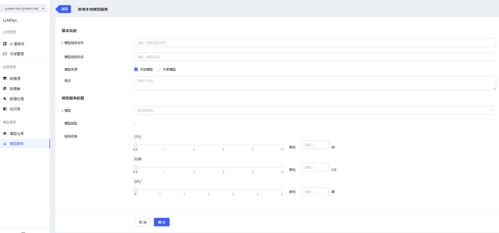
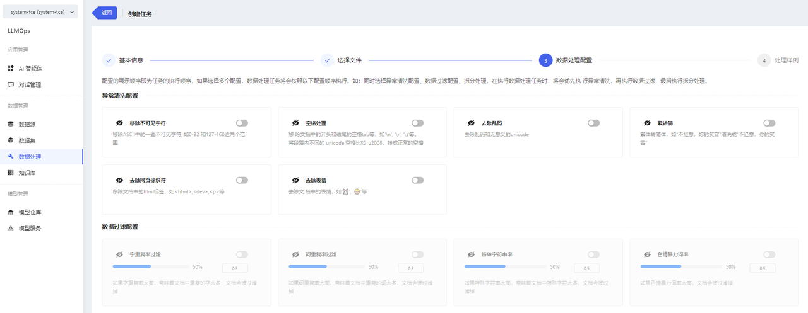
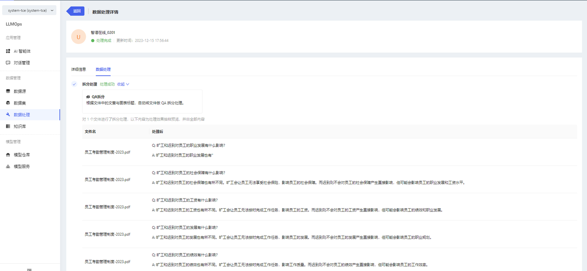

在这里将会介绍如何快速搭建一个知识库应用。

## 准备工作/前置条件
- 需要准备知识库的语料文件，暂时仅支持 pdf、docx 格式的文件
- 如果您不想使用内置模型，则需要准备模型文件
- 如果要部署本地模型服务，需要准备算力资源
- 如果对接外部模型服务，需要准备外部模型服务的信息，包含：厂商（暂时仅支持智谱、OpenAI、百川）、服务地址、Token
## 操作流程图
创建知识库

## 操作步骤
### 第一步：创建模型
在平台中，我们会内置常见的开源模型，如：qwen-7b-chat、baichuan2-7b 等（具体内置模型请见：内置模型说明）。
登录平台后，如果您使用内置模型，则可忽略此步骤；
如果您不使用内置模型，则需要准备自己的模型文件，并将其上传至模型仓库中。操作流程如下：
1. 进入模型仓库页面，点击【新增模型】按钮，进入新增模型页面，填写基本信息后，点击【确认】

2. 创建完成后，进入模型详情页面，在模型文件中上传模型文件。支持上传文件夹。

**提示**
* 上传文件时，可能需要进行证书认证。当弹窗提示证书未受信任时，点击链接手动认证证书，然后返回页面重新上传文件即可。

3. 模型其他操作
  - 部署：跳转至“模型服务/新增模型服务”页面
  - 编辑：支持编辑基本信息
  - 删除

4. 内置模型仅支持部署，不支持编辑、删除、上传文件、删除文件

5. 可在模型详情页面查看模型介绍以及模型文件

### 第二步：新增模型服务
1. 进入模型服务页面，点击【新增模型服务】按钮，进入新增模型服务页面。
  部署本地模型服务时，需要选择对应的模型，以及配置服务规格。完成填写后，点击【确定】按钮，即可完成创建操作。

2. 可在模型服务详情页面查看模型服务信息

3. 模型服务其他操作
  * 上线/下线
  * 编辑
  * 删除

### 第三步：创建数据集
1. 登录平台后，进入数据集页面，点击【新增数据集】按钮，进入新增数据集页面，填写基本信息后，点击【确认】
  * 数据集支持版本管理，新增数据集时，默认会同步新增一个 v1 版本
  * 后续若想新增其他版本，在数据集列表点击【新增版本】即可。新增的版本会延续之前的版本号

2. 新增数据集成功后，在数据集版本详情中进行文件的导入。点击【新增文件】，上传准备好的 pdf 或 docx 文件。

**提示**
* 上传文件时，可能需要进行证书认证。当弹窗提示证书未受信任时，点击链接手动认证证书，然后返回页面重新上传文件即可。

3. 数据集其他操作
  * 支持新增数据集版本
  * 支持为数据集版本导入新的数据
  * 支持查看 csv 格式的数据集文件（即经过 QA 拆分数据处理的文件，此内容会在“数据处理”模块详细描述）
  * 支持删除数据集版本
  * 支持删除数据集

### 第四步：数据处理
1. 在创建完数据集并上传文件后，可对数据集文件进行数据处理操作。进入数据处理页面，点击【创建处理任务】

2. 填写任务基本信息，并选择要处理的文件

**提示**
* 处理前数据集：选择想要处理的数据集
* 处理后数据集：选择将处理后的文件存储到哪一个数据集/版本中，v0.1.0 版本默认存储至源数据集/版本中

3. 选择完数据集文件后，选择处理配置

**提示**
* 开启开关，表示要做此项处理，关闭开关，任务将不做此项处理。最少选择一个配置，默认开启 QA 拆分开关。
* 做 QA 拆分处理时，需要选择模型服务。
* QA 拆分后，将会生成一个新的 csv 文件，其中文件内容为拆分后的 QA 。
支持在“数据集/数据集版本详情”中查看新生成的 csv 文件详情。

4. 完成配置后，可进入配置预览页面，此处内容并非真实数据处理结果，而是数据处理样例。点击【完成】按钮，即可创建数据处理任务。

5. 可在数据处理详情页面查看任务进度与结果预览。

6. 数据处理其他操作
  * 支持删除任务。如果任务正在执行中，删除任务后，已处理的文件也将同时删除；如果任务已执行完成，删除任务后，不影响处理后的数据。

### 第五步：搭建知识库
在部署完模型服务、处理完数据集数据后，可进行知识库的搭建，具体步骤如下：
1. 进入知识库页面，点击【新增知识库】，进入新增知识库页面

2. 填写基本信息，选择向量化模型，选择具体的语料文件

3. 点击【确认】按钮，即可创建成功

4. 可在知识库详情中查看文件列表以及文件的处理状态

**提示**
* 知识库创建完成后，平台会将文件自动进行向量化处理（QA 格式的文件，会将 Q 向量化），并且存储到向量数据库中。

至此，知识库搭建完成。下一步进行模型应用的创建，开始体验生成式人工智能的强大能力。
