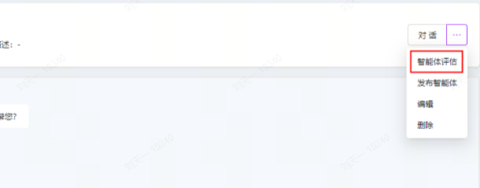
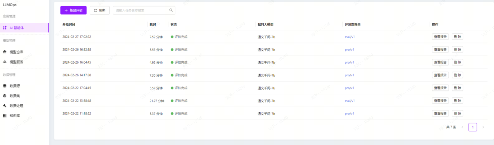
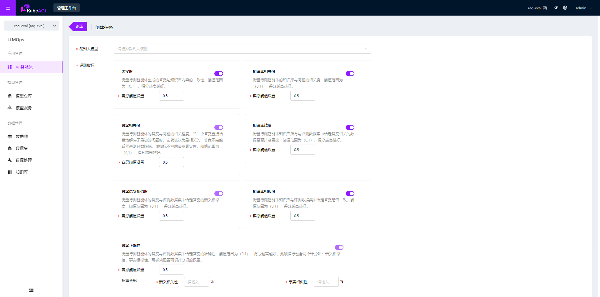
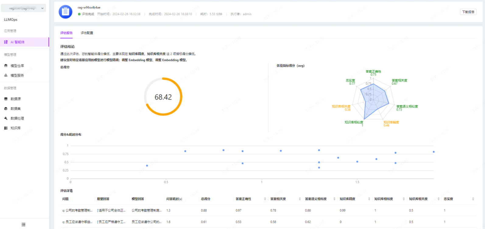

## 什么是 RAG 评估？

RAG 评估用来衡量和分析智能体性能和行为的过程，评估智能体的目的是确定它们在完成既定任务或目标时的有效性、效率、适应性和智能行为的程度。智能体评估可以基于多种标准和方法进行，包括但不限于以下几个方面：

- 性能评估：通过特定任务的完成情况来衡量智能体的效率和效果，例如任务完成的速度、准确性或对资源的使用效率。
- 行为评估：分析智能体的行为模式，包括决策过程、学习能力、以及它们如何适应环境变化或处理不确定性。
- 智能评估：通过各种测试和标准（如图灵测试等）来评价智能体的智能水平，包括理解能力、学习速度、创造力和解决问题的能力。

## KubeAGI RAG 介绍

### 前置条件

- 具备可用智能体（如果相对知识库智能体进行评估，则还应准备可用知识库，并与智能体进行关联）
- 具备裁判模型（即大模型）
- 准备评测数据

### 评估流程

在 KubeAGI 中，可以对某一个智能体发起评估，评估流程如下：

1.**数据准备**：评测数据集准备，准备问题 Q 和评测答案 A

2.**裁判大模型选择**：选择裁判大模型模型，支持本地部署模型服务与外部模型服务

3.**选择被评测智能体**  

4.**评估执行**  

- 设定评估指标，执行评估流程，记录评估结果。
- 对比不同模型的性能，分析各自的优势和不足。

5.**结果分析**  

- 解读评估结果，识别智能体的强项和弱点。
- 根据评估结果提出模型改进的建议。

### 具体操作

1.进入智能体页面，点击选择想要评测的智能体，进入智能体详情。在智能体详情的操作下拉列表中，点击选择【智能体评估】，即可进入智能体评估页面。

2.点击【新建评估】，即可为当前智能体创建新的评估任务。

> 新建评估任务时，会根据智能体的最新配置执行评估任务。

3.选择裁判大模型、评测指标、评测数据集后，点击【创建】，即可完成创建，评估任务立即执行。

> 评测指标中，答案相关度、答案语义相似度、答案正确性为必选指标；
>
> 如果智能体未关联知识库，则忠实度、知识库相关度、知识库精度、知识库相似度指标不可选。

4.在评估任务列表中，可查看任务的状态与基本信息，点击【查看报告】，即可进入评估报告页面。

在报告中可查看智能体的总分、各指标得分，以及每一条评测数据的问答、得分、耗时情况。

同时可以查看此次任务智能体的详细配置。

